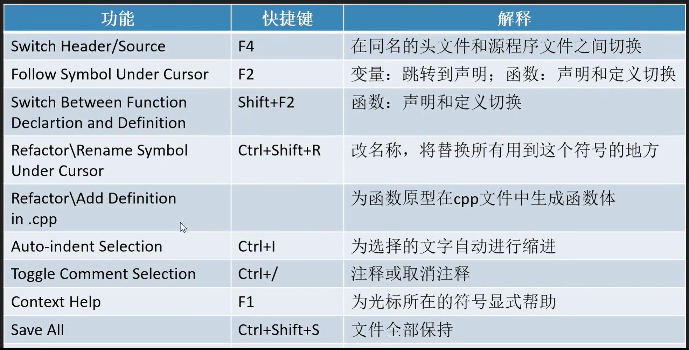
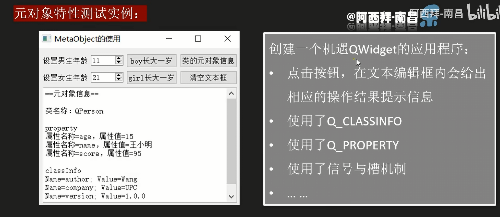

# QT Study

## 第二章 QT creator 使用快捷技巧

## 第三章

### 3.1 Qt 核心特点

#### 3.1.1 元对象系统

Qt 的**元对象系统（Meta-Object System）** 是其核心特性之一，它为 Qt 提供了许多独特功能的底层支持，比如信号与槽（Signals & Slots）、运行时类型信息（RTTI）、动态属性系统等。理解元对象系统是掌握 Qt 核心机制的关键。

元对象系统主要由三部分构成，三者协同工作：

1. **QObject 类**：所有需要使用元对象功能的类都必须直接或间接继承自 `QObject`，它是元对象系统的 “宿主” 基类。
2. **元对象编译器（moc，Meta-Object Compiler）**：Qt 提供的一个预处理器，负责解析 C++ 代码中标记了元对象特性的类（如包含 `Q_OBJECT` 宏的类），生成额外的 C++ 代码（通常以 `moc_*.cpp` 命名），这些代码实现了元对象的具体功能（如信号与槽的绑定、类型信息存储等）。
3. **Q_OBJECT 宏**：在类的定义中声明此宏，用于告诉 moc “这个类需要元对象支持”。moc 会自动为包含该宏的类生成元对象代码，并注入到编译过程中。

#### 3.1.2 属性系统、信号与槽

1. **信号与槽（Signals & Slots）**

这是 Qt 最具代表性的特性，用于对象间的通信（替代传统回调函数）。

- 信号（Signal）：对象状态变化时发出的通知（无需实现，由 moc 自动生成）。

- 槽（Slot）：接收信号并处理的函数（需要手动实现）。

  元对象系统通过`QObject::connect()`方法在运行时建立信号与槽的关联，并负责在信号触发时调用对应的槽函数。

  ~~~
  class MyObject : public QObject {
      Q_OBJECT  // 必须声明此宏
  signals:
      void valueChanged(int newValue);  // 信号（无需实现）
  public slots:
      void onValueChanged(int value) {  // 槽函数（需要实现）
          qDebug() << "Value changed to:" << value;
      }
  };
  
  // 使用时关联信号与槽
  MyObject obj1, obj2;
  QObject::connect(&obj1, &MyObject::valueChanged, &obj2, &MyObject::onValueChanged);
  obj1.valueChanged(42);  // 触发信号，obj2 的槽函数会被调用
  ~~~

2. **运行时类型信息（RTTI）**

标准 C++ 的 RTTI 功能有限（如 `dynamic_cast` 和 `typeid`），而 Qt 元对象系统提供了更强大的运行时类型查询能力：

- `QObject::metaObject()`：返回类的元对象（`QMetaObject` 实例），包含类的类型信息。
- `QMetaObject::className()`：获取类名（无需 `typeid`，且支持基类查询）。
- `qobject_cast<T>()`：安全的类型转换（比 `dynamic_cast` 更高效，仅适用于 `QObject` 派生类）。

~~~
QObject *obj = new MyObject();
qDebug() << obj->metaObject()->className();  // 输出 "MyObject"
MyObject *myObj = qobject_cast<MyObject*>(obj);  // 转换成功，返回非空指针
~~~

3. **动态属性系统**

元对象系统允许在运行时为 `QObject` 派生类添加动态属性（无需在类定义中声明），并通过元对象进行访问：

- `QObject::setProperty(const char *name, const QVariant &value)`：设置动态属性。
- `QObject::property(const char *name)`：获取动态属性值（返回 `QVariant`）。

~~~
QObject *obj = new QObject();
obj->setProperty("color", "red");  // 添加动态属性 "color"
qDebug() << obj->property("color").toString();  // 输出 "red"
~~~

4. **反射（Reflection）能力**

通过 `QMetaObject` 可以在运行时查询类的成员信息（如信号、槽、属性、方法等），实现类似反射的功能：

- 枚举类的所有方法、属性、信号。
- 动态调用类的方法（通过 `QMetaObject::invokeMethod()`）。

示例：

~~~
MyObject obj;
// 动态调用槽函数 onValueChanged，并传递参数 100
QMetaObject::invokeMethod(&obj, "onValueChanged", Q_ARG(int, 100));
~~~

### 3.end 项目练习

#### 元对象特性测试实例

~~~
### 关键宏说明总结
| 宏/关键字       | 作用                                                                 | 必备性               |
|-----------------|----------------------------------------------------------------------|----------------------|
| `Q_OBJECT`      | 启用元对象系统支持（信号槽、属性、元信息等），必须配合moc编译         | 元对象功能类必备     |
| `Q_CLASSINFO`   | 为类添加自定义元信息，可在运行时通过`QMetaObject`读取                 | 可选（按需添加）|
| `Q_PROPERTY`    | 声明类的属性，使属性可通过元对象系统动态访问、修改                   | 需属性暴露时使用     |
| `signals`       | 声明信号（特殊的成员函数，由moc生成实现），用于对象间事件通知         | 需信号槽通信时使用   |

这些宏是Qt元对象系统的“基础设施”，通过它们可以让C++类具备动态反射、属性化、信号槽通信等高级特性，是Qt框架灵活性和易用性的核心保障。
~~~

#### 3.end.bug1

**链接错误**，原因是声明了函数但未实现，**只要是声明的函数一定要显示申明，这个是属于链接问题！**

#### 