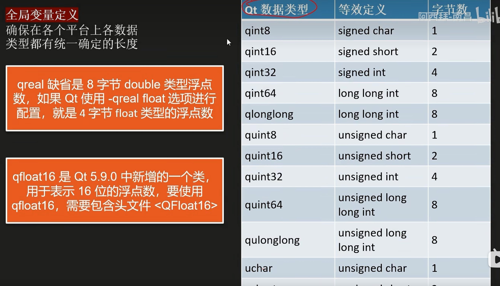
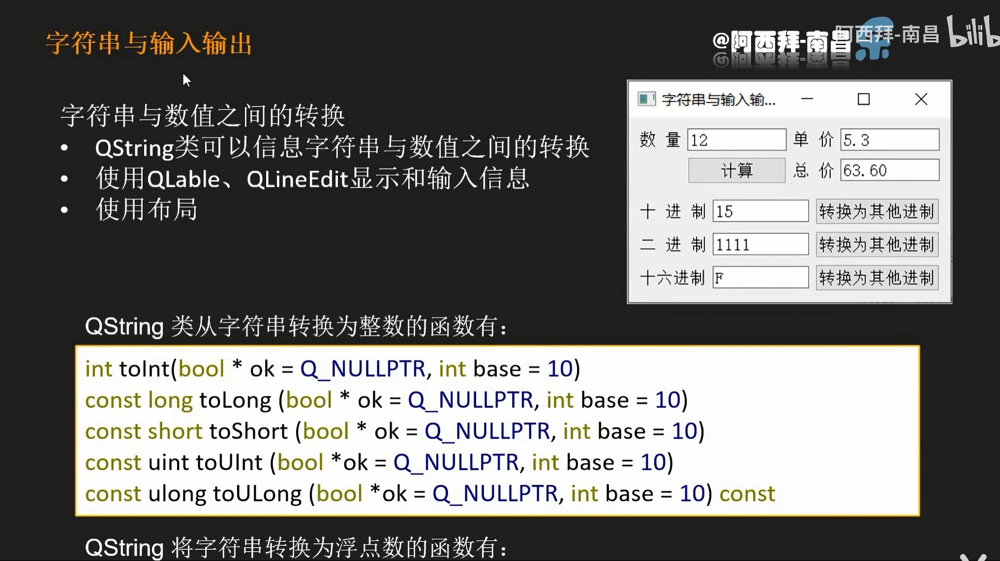

# QT Study

## 第二章 QT creator 使用快捷技巧

## 第三章

### 3.1 Qt 核心特点

#### 3.1.1 元对象系统

Qt 的**元对象系统（Meta-Object System）** 是其核心特性之一，它为 Qt 提供了许多独特功能的底层支持，比如信号与槽（Signals & Slots）、运行时类型信息（RTTI）、动态属性系统等。理解元对象系统是掌握 Qt 核心机制的关键。

元对象系统主要由三部分构成，三者协同工作：

1. **QObject 类**：所有需要使用元对象功能的类都必须直接或间接继承自 `QObject`，它是元对象系统的 “宿主” 基类。
2. **元对象编译器（moc，Meta-Object Compiler）**：Qt 提供的一个预处理器，负责解析 C++ 代码中标记了元对象特性的类（如包含 `Q_OBJECT` 宏的类），生成额外的 C++ 代码（通常以 `moc_*.cpp` 命名），这些代码实现了元对象的具体功能（如信号与槽的绑定、类型信息存储等）。
3. **Q_OBJECT 宏**：在类的定义中声明此宏，用于告诉 moc “这个类需要元对象支持”。moc 会自动为包含该宏的类生成元对象代码，并注入到编译过程中。

#### 3.1.2 属性系统、信号与槽

1. **信号与槽（Signals & Slots）**

这是 Qt 最具代表性的特性，用于对象间的通信（替代传统回调函数）。

- 信号（Signal）：对象状态变化时发出的通知（无需实现，由 moc 自动生成）。

- 槽（Slot）：接收信号并处理的函数（需要手动实现）。

  元对象系统通过`QObject::connect()`方法在运行时建立信号与槽的关联，并负责在信号触发时调用对应的槽函数。

  ~~~
  class MyObject : public QObject {
      Q_OBJECT  // 必须声明此宏
  signals:
      void valueChanged(int newValue);  // 信号（无需实现）
  public slots:
      void onValueChanged(int value) {  // 槽函数（需要实现）
          qDebug() << "Value changed to:" << value;
      }
  };
  
  // 使用时关联信号与槽
  MyObject obj1, obj2;
  QObject::connect(&obj1, &MyObject::valueChanged, &obj2, &MyObject::onValueChanged);
  obj1.valueChanged(42);  // 触发信号，obj2 的槽函数会被调用
  ~~~

2. **运行时类型信息（RTTI）**

标准 C++ 的 RTTI 功能有限（如 `dynamic_cast` 和 `typeid`），而 Qt 元对象系统提供了更强大的运行时类型查询能力：

- `QObject::metaObject()`：返回类的元对象（`QMetaObject` 实例），包含类的类型信息。
- `QMetaObject::className()`：获取类名（无需 `typeid`，且支持基类查询）。
- `qobject_cast<T>()`：安全的类型转换（比 `dynamic_cast` 更高效，仅适用于 `QObject` 派生类）。

~~~
QObject *obj = new MyObject();
qDebug() << obj->metaObject()->className();  // 输出 "MyObject"
MyObject *myObj = qobject_cast<MyObject*>(obj);  // 转换成功，返回非空指针
~~~

3. **动态属性系统**

元对象系统允许在运行时为 `QObject` 派生类添加动态属性（无需在类定义中声明），并通过元对象进行访问：

- `QObject::setProperty(const char *name, const QVariant &value)`：设置动态属性。
- `QObject::property(const char *name)`：获取动态属性值（返回 `QVariant`）。

~~~
QObject *obj = new QObject();
obj->setProperty("color", "red");  // 添加动态属性 "color"
qDebug() << obj->property("color").toString();  // 输出 "red"
~~~

4. **反射（Reflection）能力**

通过 `QMetaObject` 可以在运行时查询类的成员信息（如信号、槽、属性、方法等），实现类似反射的功能：

- 枚举类的所有方法、属性、信号。
- 动态调用类的方法（通过 `QMetaObject::invokeMethod()`）。

示例：

~~~
MyObject obj;
// 动态调用槽函数 onValueChanged，并传递参数 100
QMetaObject::invokeMethod(&obj, "onValueChanged", Q_ARG(int, 100));
~~~

### 3.2 全局定义

**还有很多，查资料或者开发手册即可**

### 3.3 容器类

Qt 提供了一套功能丰富的容器类（Container Classes），用于存储和管理数据，类似于 C++ 标准库的 STL 容器，但针对 Qt 的特性（如跨平台、元对象系统、隐式共享等）进行了优化。这些容器类类型安全、使用便捷，且支持 Qt 的迭代器、算法等工具。

#### 3.3.1 常用容器类分类及示例

Qt 容器主要分为**顺序容器**（线性存储）和**关联容器**（键值对存储），以下是最常用的类型：

##### 3.3.1.1 顺序容器

按线性顺序存储元素，支持索引访问。

| 容器类             | 特点与用途                                                   | 示例代码                                                     |
| ------------------ | ------------------------------------------------------------ | ------------------------------------------------------------ |
| **QList<T>**       | 最常用的容器，动态数组，支持快速随机访问，适合存储小型元素（如 int、指针）。内部使用数组 + 链表混合实现，插入删除效率高。 | `cpp QList<int> list; list << 1 << 2 << 3; // 插入元素 int val = list[1]; // 访问（索引从0开始） list.removeAt(0); // 删除第一个元素` |
| **QVector<T>**     | 连续内存的动态数组，与 C++ 原生数组兼容，适合存储大型元素或需要频繁随机访问的场景。 | `cpp QVector<QString> vec; vec.append("Qt"); vec.append("Container"); for (auto s : vec) { qDebug() << s; }` |
| **QLinkedList<T>** | 双向链表，适合频繁在中间插入 / 删除元素（时间复杂度 O (1)），但随机访问效率低（O (n)）。 | `cpp QLinkedList<double> linked; linked.push_back(3.14); linked.push_front(2.71); linked.removeFirst();` |
| **QByteArray**     | 专门存储字节数据（char 序列），比 `QList<char>` 更高效，常用于文件 I/O、网络数据传输。 | `cpp QByteArray ba = "Hello Qt"; ba.append("!"); const char* data = ba.data(); // 转为 C 风格字符串` |
| **QStringList**    | 继承自 `QList<QString>`，专为字符串列表设计，提供额外字符串相关方法（如 `join`、`filter`）。 | `cpp QStringList strList = {"apple", "banana"}; strList << "orange"; QString all = strList.join(", "); // 拼接为 "apple, banana, orange"` |

##### 3.3.1.2 关联容器

按键（Key）存储元素，支持快速查找（基于哈希表或红黑树）。

| 容器类                | 特点与用途                                                   | 示例代码                                                     |
| --------------------- | ------------------------------------------------------------ | ------------------------------------------------------------ |
| **QMap<Key, T>**      | 按键排序的映射表（基于红黑树），键唯一，支持范围查找，适合需要有序遍历的场景。 | `cpp QMap<QString, int> map; map["one"] = 1; map["two"] = 2; int val = map.value("one"); // 获取值（默认返回0） for (auto it = map.begin(); it != map.end(); ++it) { qDebug() << it.key() << ":" << it.value(); }` |
| **QMultiMap<Key, T>** | 支持重复键的映射表（继承自 `QMap`），适合一对多的映射关系（如 “标签 - 文件”）。 | `cpp QMultiMap<QString, int> multiMap; multiMap.insert("score", 90); multiMap.insert("score", 85); // 重复键 QList<int> scores = multiMap.values("score"); // 获取所有值` |
| **QHash<Key, T>**     | 基于哈希表的映射表，查找速度比 `QMap` 更快（平均 O (1)），但键无序，要求 Key 支持 `operator==` 和哈希函数。 | `cpp QHash<int, QString> hash; hash[100] = "满分"; hash[60] = "及格"; if (hash.contains(60)) { qDebug() << hash[60]; }` |
| **QSet<T>**           | 基于 `QHash` 的集合（无重复元素，无序），适合去重、集合运算（交集、并集）。 | `cpp QSet<int> set; set << 1 << 2 << 2; // 自动去重 QSet<int> set2 = {2, 3}; QSet<int> intersection = set & set2; // 交集 {2}` |

#### 3.3.2 容器的迭代器（Iterators）

Qt 容器支持两种迭代器，用法类似 STL：

##### 3.3.2.1 **Java 风格迭代器**（适合初学者，API 更直观）

- `QListIterator<T>`：只读迭代器
- `QMutableListIterator<T>`：可修改元素的迭代器

~~~C++
QList<int> list = {1, 2, 3};
QListIterator<int> it(list); // 只读迭代器
while (it.hasNext()) {
    qDebug() << it.next(); // 遍历元素
}

QMutableListIterator<int> mit(list);
while (mit.hasNext()) {
    if (mit.next() == 2) {
        mit.setValue(20); // 修改元素值
    }
}
~~~

##### 3.3.2.2 **STL 风格迭代器**（兼容 STL 算法，适合熟悉 STL 的开发者）

- `const_iterator`：只读迭代器
- `iterator`：可修改迭代器

~~~c++
QVector<QString> vec = {"a", "b", "c"};
// 只读遍历
for (QVector<QString>::const_iterator it = vec.begin(); it != vec.end(); ++it) {
    qDebug() << *it;
}
// 修改元素
for (auto it = vec.begin(); it != vec.end(); ++it) {
    *it = *it + "x";
}
~~~

#### 3.3.3 容器的常用操作

所有 Qt 容器都支持一些通用操作：

- 插入：`append()`、`prepend()`、`insert()`

- 删除：`removeAt()`、`removeOne()`、`clear()`

- 查找：`contains()`、`indexOf()`、`find()`

- 大小：`size()`、`isEmpty()`

- 遍历：`foreach` 关键字（Qt 扩展，简化遍历）

  示例（`foreach` 遍历）：

  ~~~C++
  QStringList list = {"Qt", "C++", "Container"};
  foreach (const QString &s, list) { // 注意：变量前需加 const（只读）
      qDebug() << s;
  }
  ~~~

#### 3.3.4 选择容器的建议

1. 优先使用 `QList` 或 `QVector`：大多数场景下性能和易用性最佳。
2. 存储字符串列表用 `QStringList`：提供更多字符串专属方法。
3. 键值对且需排序用 `QMap`，无需排序用 `QHash`（速度更快）。
4. 频繁中间插入 / 删除用 `QLinkedList`，但尽量避免（`QList` 通常足够高效）。
5. 字节数据用 `QByteArray`，字符串用 `QString`（而非 `std::string`）。

### 3.4 QT类库的模块

#### 3.4.1 基础核心模块

| 模块名称       | 功能说明                                                     | 核心类示例                                                   |
| -------------- | ------------------------------------------------------------ | ------------------------------------------------------------ |
| **Qt Core**    | 提供 Qt 最核心的非 GUI 功能：元对象系统、容器类、事件循环、线程、时间日期、文件 I/O 等，是所有模块的基础。 | `QObject`、`QString`、`QList`、`QThread`、`QFile`            |
| **Qt Gui**     | 提供 GUI 基础功能：绘图、字体、颜色、图像、输入设备（鼠标 / 键盘）、窗口系统集成等。 | `QPainter`、`QImage`、`QFont`、`QColor`、`QMouseEvent`       |
| **Qt Widgets** | 提供传统桌面端的 GUI 控件（按钮、文本框、窗口等），基于 `Qt Gui` 构建，支持经典的窗口界面开发。 | `QWidget`、`QPushButton`、`QLineEdit`、`QMainWindow`、`QDialog` |

#### 3.4.2 扩展功能模块

| 模块名称                    | 功能说明                                                     | 核心类示例                                          |
| --------------------------- | ------------------------------------------------------------ | --------------------------------------------------- |
| **Qt Network**              | 提供跨平台网络编程支持：TCP/UDP 套接字、HTTP/HTTPS 协议、FTP、网络请求等。 | `QTcpSocket`、`QUdpSocket`、`QNetworkAccessManager` |
| **Qt Sql**                  | 提供数据库操作接口，支持 SQLite、MySQL、PostgreSQL、Oracle 等主流数据库。 | `QSqlDatabase`、`QSqlQuery`、`QSqlTableModel`       |
| **Qt Xml / Qt XmlPatterns** | 处理 XML 数据：`Qt Xml` 提供基础 XML 解析 / 生成，`Qt XmlPatterns` 支持 XSLT 和 XPath 高级操作。 | `QDomDocument`、`QXmlStreamReader`、`QXmlQuery`     |
| **Qt Multimedia**           | 提供多媒体功能：音频 / 视频播放、录音、摄像头采集、音频设备管理等。 | `QMediaPlayer`、`QCamera`、`QAudioRecorder`         |
| **Qt Multimedia Widgets**   | 基于 `Qt Widgets` 的多媒体控件（如视频播放器窗口）。         | `QVideoWidget`、`QMediaPlaylist`                    |
| **Qt Print Support**        | 提供打印功能：打印文档、打印机配置、打印预览等。             | `QPrinter`、`QPrintDialog`、`QPrintPreviewWidget`   |

#### 3.4.3 界面与交互模块

专注于用户界面设计和交互体验。

| 模块名称                   | 功能说明                                                     | 核心类示例                                |
| -------------------------- | ------------------------------------------------------------ | ----------------------------------------- |
| **Qt Designer Components** | 用于扩展 Qt Designer（可视化界面设计工具），支持自定义控件在 Designer 中使用。 | `QDesignerCustomWidgetInterface`          |
| **Qt UI Tools**            | 加载 Qt Designer 生成的 `.ui` 文件（无需手动转换为代码）。   | `QUiLoader`                               |
| **Qt Style Sheets**        | 支持 CSS 风格的界面样式定制（类似网页样式表），用于美化控件外观。 | 无特定类，通过 `setStyleSheet()` 方法使用 |

#### 3.4.4 图形与动画模块

| 模块名称           | 功能说明                                                     | 核心类示例                                         |
| ------------------ | ------------------------------------------------------------ | -------------------------------------------------- |
| **Qt 2D Graphics** | 高级 2D 绘图功能：矢量图形、路径、渐变、抗锯齿等（基于 `Qt Gui` 扩展）。 | `QGraphicsScene`、`QGraphicsView`、`QGraphicsItem` |
| **Qt 3D**          | 提供 3D 渲染引擎：3D 模型加载、光照、材质、相机控制等（Qt 5 后新增）。 | `Q3DScene`、`Q3DCamera`、`Q3DLight`                |
| **Qt Animation**   | 实现界面动画效果：控件移动、缩放、透明度变化，支持动画曲线和过渡效果。 | `QPropertyAnimation`、`QParallelAnimationGroup`    |

#### 3.4.5 跨平台与系统集成模块

| 模块名称                              | 功能说明                                                     | 核心类示例                                                   |
| ------------------------------------- | ------------------------------------------------------------ | ------------------------------------------------------------ |
| **Qt Platform Headers**               | 访问特定平台的底层功能（如 Windows API、X11 等），用于跨平台适配的高级需求。 | 平台相关，如 `QWinWidget`（Windows）                         |
| **Qt DBus**                           | 支持 D-Bus 协议（Linux 桌面系统的进程间通信标准），用于 Linux 平台下的进程通信。 | `QDBusInterface`、`QDBusMessage`                             |
| **Qt Android Extras / Qt iOS Extras** | 提供 Android/iOS 平台的额外功能接口（如调用系统 API、访问传感器等）。 | `QAndroidJniObject`（Android）、`QIOSApplicationDelegate`（iOS） |

#### 3.4.6 其他模块

| 模块名称              | 功能说明                                                     | 核心类示例                               |
| --------------------- | ------------------------------------------------------------ | ---------------------------------------- |
| **Qt Test**           | 单元测试框架，用于编写和运行 Qt 代码的自动化测试用例。       | `QTest`、`QTest::keyClick()`             |
| **Qt Concurrent**     | 简化多线程编程，基于模板实现并行计算（无需直接操作 `QThread`）。 | `QtConcurrent::map`、`QtConcurrent::run` |
| **Qt Linguist Tools** | 国际化与本地化工具，支持多语言翻译、字符串提取和替换。       | `QTranslator`、`QLocale`                 |

#### 3.4.7 模块使用方式

在 Qt 项目中，通过 `.pro` 文件（Qt 构建文件）引入模块，例如：

~~~C++
# 引入核心模块
QT += core gui widgets

# 引入扩展模块（按需添加）
QT += network sql multimedia
~~~

在 C++ 代码中，通过 `#include` 引入模块中的类，例如：

~~~C++
#include <QWidget>      // Qt Widgets 模块
#include <QTcpSocket>   // Qt Network 模块
#include <QSqlDatabase> // Qt Sql 模块
~~~

### 3.end 项目练习

#### 元对象特性测试实例

~~~
### 关键宏说明总结
| 宏/关键字       | 作用                                                                 | 必备性               |
|-----------------|----------------------------------------------------------------------|----------------------|
| `Q_OBJECT`      | 启用元对象系统支持（信号槽、属性、元信息等），必须配合moc编译         | 元对象功能类必备     |
| `Q_CLASSINFO`   | 为类添加自定义元信息，可在运行时通过`QMetaObject`读取                 | 可选（按需添加）|
| `Q_PROPERTY`    | 声明类的属性，使属性可通过元对象系统动态访问、修改                   | 需属性暴露时使用     |
| `signals`       | 声明信号（特殊的成员函数，由moc生成实现），用于对象间事件通知         | 需信号槽通信时使用   |

这些宏是Qt元对象系统的“基础设施”，通过它们可以让C++类具备动态反射、属性化、信号槽通信等高级特性，是Qt框架灵活性和易用性的核心保障。
~~~

#### 3.end.bug1

**链接错误**，原因是声明了函数但未实现，**只要是声明的函数一定要显示申明，这个是属于链接问题！**

## 第四章

### 4.1 字符串QString

4.end